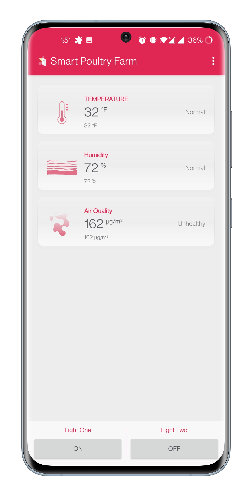
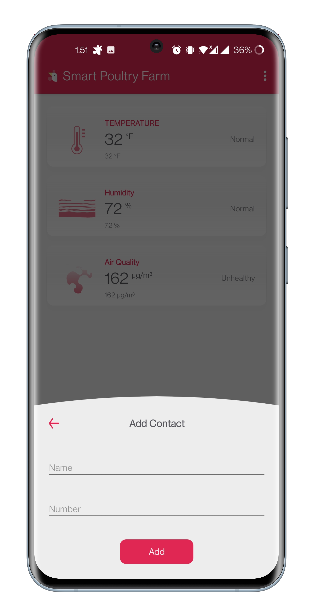
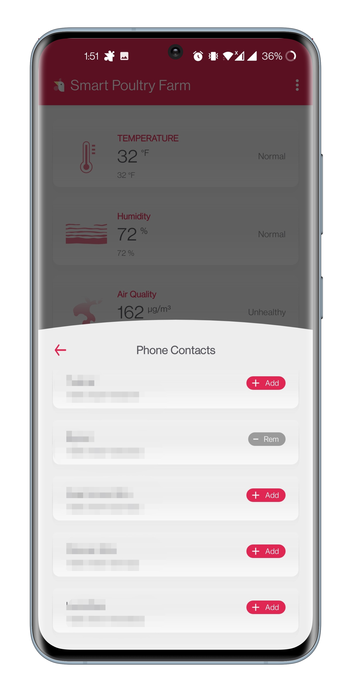
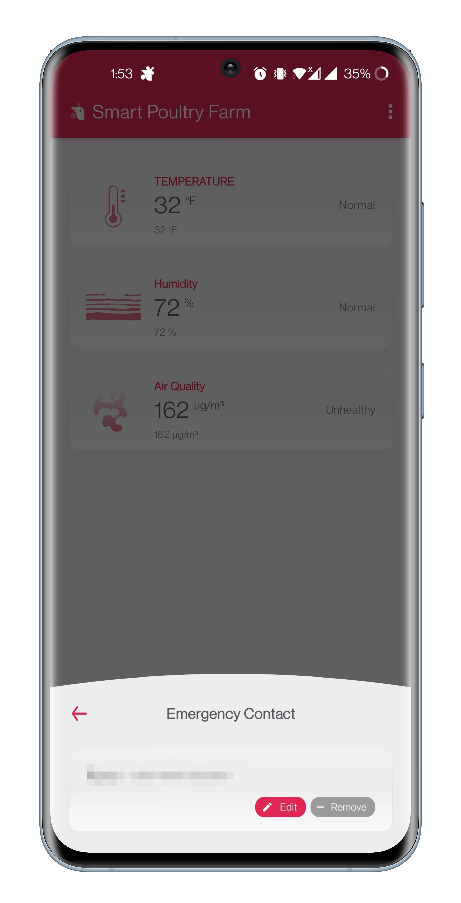
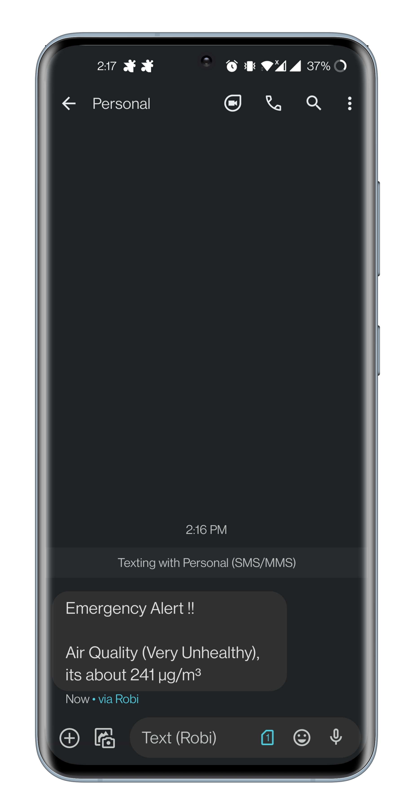
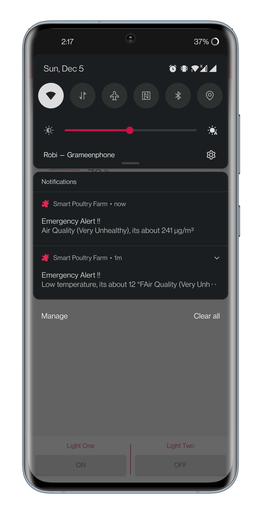

# Smart Poultry Farm

> Basically an IOT based app.
<!-- START doctoc generated TOC please keep comment here to allow auto update -->
<!-- DON'T EDIT THIS SECTION, INSTEAD RE-RUN doctoc TO UPDATE -->
**Table of Contents**

- [Installation](#installation)
    - [Binaries](#binaries)
    - [Via Go](#via-go)
- [Snapshots](#snapshots)

<!-- END doctoc generated TOC please keep comment here to allow auto update -->

## Installation

#### Binaries

[Download and Install](https://github.com/rihansr/SmartPoultryFarm/raw/main/files/apk/smart_poultry_farm.apk) latest apk.

#### Via Go

```console
https://github.com/rihansr/SmartPoultryFarm/blob/main/files/apk/smart_poultry_farm.apk
```

## Snapshots
     
